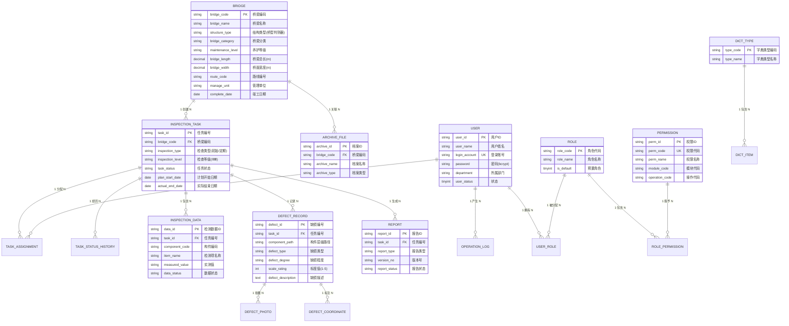
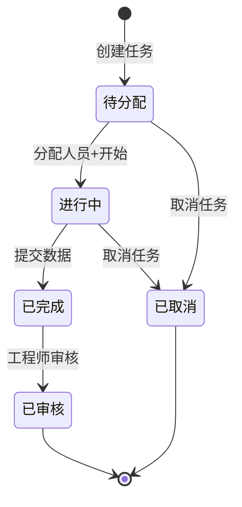
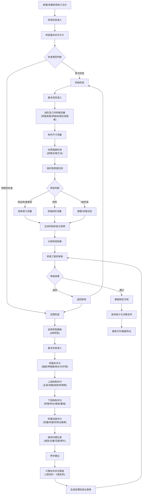
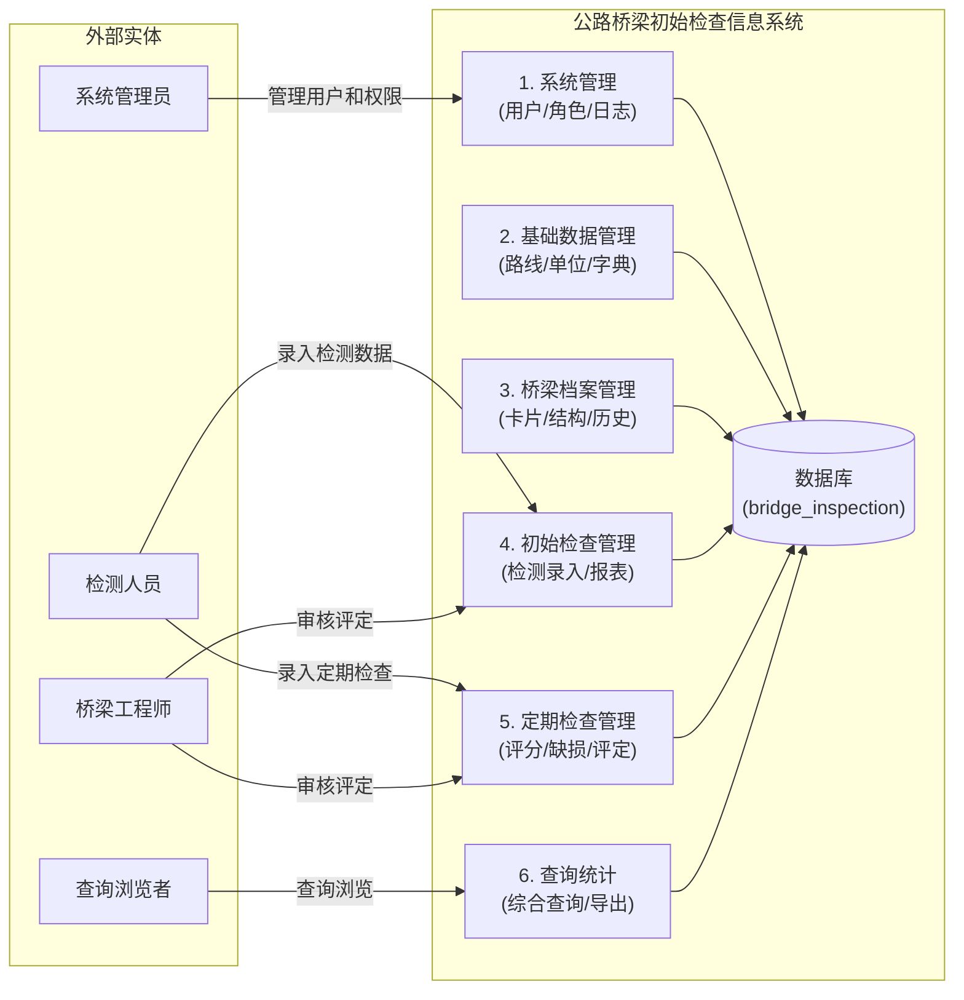
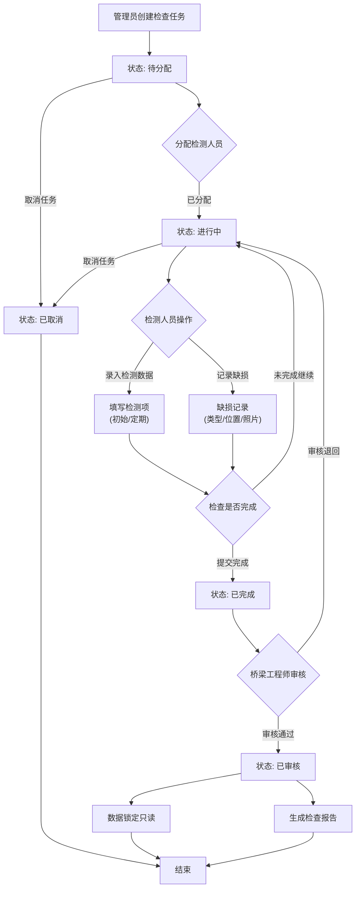
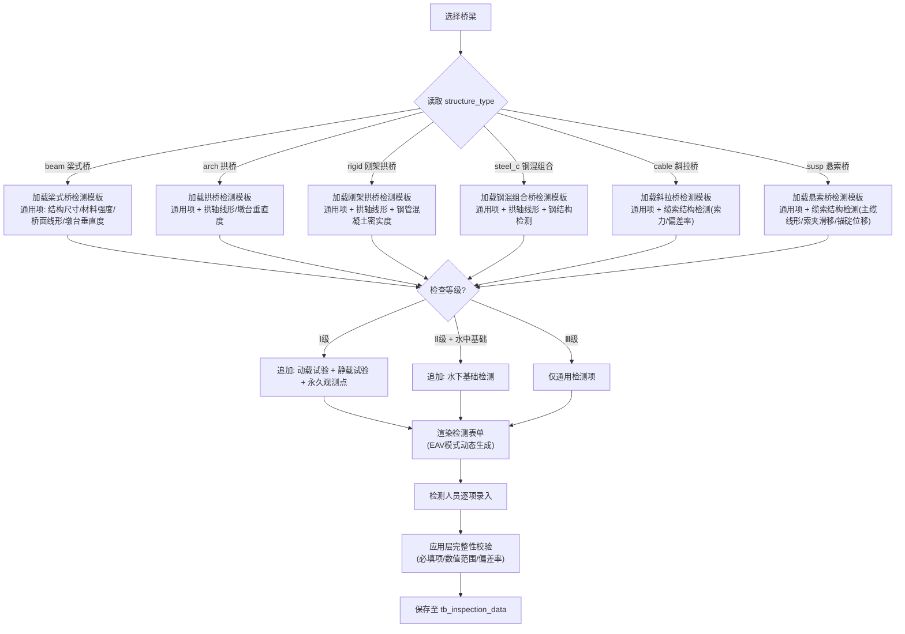
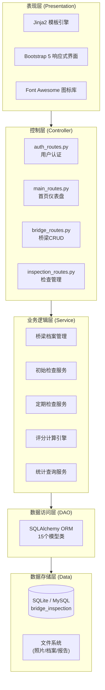

# 公路桥梁初始检查信息系统 — ER图、逻辑模型、物理模型、流程图及项目分类

> 依据：JTG 5120-2021《公路桥涵养护规范》+ 概要设计文档 §3.2
> 数据库：MySQL 8.0 / SQLite 3（开发）

---

## 📸 渲染图片索引

所有图表已渲染为 PNG/SVG，存放在 `../diagrams/output/` 目录下：

### 🗂️ ER 图（中文，4张）

| 文件 | 说明 |
|------|------|
| `er-01-concept-cn.png` | **概念层 ER 图** — 16个实体 + 完整关系，精简关键属性 |
| `er-02-business-cn.png` | **核心业务 ER 图** — 桥梁/检查任务/检测数据/缺损记录/缺损照片/标注坐标，含全部字段 |
| `er-03-report-archive-cn.png` | **报告与档案 ER 图** — 报告/档案文件，含全部字段 |
| `er-04-rbac-cn.png` | **RBAC权限系统 ER 图** — 用户/角色/权限/用户角色/角色权限/操作日志/字典/任务分配/状态历史，含全部字段 |

### 🔄 流程图（4张）

| 文件 | 说明 |
|------|------|
| `04-core-business-flow.png` | 核心业务流程图（竣工→初始检查→定期检查→审核→归档） |
| `05-task-state.png` | 任务状态流转图（待分配→进行中→已完成→已审核→已取消） |
| `06-system-dfd.png` | 系统数据流图 DFD 0层（4类用户×6个子系统的数据交互） |
| `07-task-lifecycle.png` | 任务生命周期流程图（创建→分配→检测→提交→审核 完整路径） |

### 🏗️ 架构与分类图（3张）

| 文件 | 说明 |
|------|------|
| `08-bridge-type-dispatch.png` | 桥型分派多态检测流程图（6种桥型×3个等级→动态检测模板） |
| `09-tech-architecture.png` | 技术架构分层图（表现层→控制层→业务层→DAO→存储层） |
| `10-func-architecture.png` | 系统功能架构分类图（6大子系统完整功能树） |

> 💡 **提示**：以下 Mermaid 代码块可在支持 Mermaid 的 Markdown 查看器中直接渲染。如需静态图片，请使用上方索引的 PNG/SVG 文件。

---

# 一、ER 图（实体-关系图）

## 1.1 概念层 ER 图（Mermaid）



## 1.2 简化版 ER 图（核心业务）

```
                         ┌──────────────────────────────────────────┐
                         │              桥梁 (Bridge)                │
                         │  bridge_code PK, structure_type,          │
                         │  bridge_category, maintenance_level       │
                         └──┬──────────┬──────────┬─────────────────┘
                            │1         │1         │1
              ┌─────────────┘          │          └──────────────┐
              ▼                        ▼                         ▼
   ┌────────────────────┐  ┌────────────────────┐  ┌────────────────────┐
   │   检查任务          │  │    档案文件         │  │     报告           │
   │ (InspectionTask)   │  │  (ArchiveFile)     │  │   (Report)         │
   │ task_id PK         │  │ archive_id PK      │  │ report_id PK       │
   │ bridge_code FK     │  │ bridge_code FK     │  │ task_id FK         │
   │ inspection_type    │  │ archive_type       │  │ report_type        │
   │ inspection_level   │  └────────────────────┘  │ version_no         │
   │ task_status        │                          └────────────────────┘
   └──┬──┬──┬──┬────────┘
      │1 │1 │1 │1
      ▼  ▼  ▼  ▼
 ┌──────┐┌──────────┐┌───────────────────┐┌──────────────────┐
 │ 分配 ││ 状态历史  ││    检测数据        ││   缺损记录        │
 │(Asg) ││ (Hist)   ││(InspectionData)   ││(DefectRecord)    │
 └──────┘└──────────┘│ EAV模式承载多态:   ││ defect_type      │
                     │ 拱桥→拱轴线形     ││ defect_degree    │
                     │ 斜拉桥→索力/偏差率││ scale_rating     │
                     │ Ⅰ级→动载/静载试验 │└──┬───┬──────────┘
                     └───────────────────┘  │1  │1
                                            ▼   ▼
                                      ┌──────────┐┌──────────────┐
                                      │ 缺损照片  ││  标注坐标     │
                                      │(Photo)   ││(Coordinate)  │
                                      └──────────┘└──────────────┘

   ┌────────┐  N:M   ┌────────┐  N:M   ┌────────┐
   │  用户  │◄──────►│  角色  │◄──────►│  权限  │
   │ (User) │        │ (Role) │        │ (Perm) │
   └───┬────┘        └────────┘        └────────┘
       │1
       ▼
   ┌──────────┐     ┌──────────┐  1:N  ┌──────────┐
   │ 操作日志 │     │ 字典类型  │◄─────►│ 字典项   │
   │  (Log)   │     │(DictType)│       │(DictItem)│
   └──────────┘     └──────────┘       └──────────┘
```

---

# 二、逻辑模型（Logical Data Model）

## 2.1 逻辑模型概述

逻辑模型共包含 **18张表**（含2张关联表），分为5个逻辑域：

| 逻辑域 | 表数 | 说明 |
|--------|------|------|
| 桥梁档案域 | 3 | tb_bridge, tb_archive_file, 路线/单位(ORM侧) |
| 检查业务域 | 5 | tb_inspection_task, tb_inspection_data, tb_defect_record, tb_defect_photo, tb_defect_coordinate |
| 任务管理域 | 2 | tb_task_assignment, tb_task_status_history |
| 报告域 | 1 | tb_report |
| 系统管理域 | 7 | tb_user, tb_role, tb_permission, tb_user_role, tb_role_permission, tb_dict_type, tb_dict_item, tb_operation_log |

## 2.2 逻辑模型 — 表结构（属性+主键+外键）

```
╔══════════════════════════════════════════════════════════════════╗
║  逻辑域 1：桥梁档案域                                            ║
╠══════════════════════════════════════════════════════════════════╣
║                                                                  ║
║  tb_bridge (桥梁基本信息)                                        ║
║  ┌─────────────────────────────────────────────────────────┐    ║
║  │ PK  bridge_code        VARCHAR(20)   桥梁编码             │    ║
║  │     bridge_name        VARCHAR(100)  桥梁名称 NOT NULL    │    ║
║  │     route_code         VARCHAR(20)   路线编号             │    ║
║  │     route_name         VARCHAR(100)  路线名称             │    ║
║  │     pile_number        VARCHAR(50)   桥位桩号             │    ║
║  │     bridge_category    VARCHAR(20)   桥梁分类             │    ║
║  │     structure_type     VARCHAR(30)   结构类型 NOT NULL    │    ║
║  │     superstructure_type VARCHAR(50)  上部结构类型          │    ║
║  │     substructure_type  VARCHAR(50)   下部结构类型          │    ║
║  │     foundation_type    VARCHAR(50)   基础类型             │    ║
║  │     span_combination   VARCHAR(100)  跨径组合             │    ║
║  │     bridge_length      DECIMAL(10,2) 桥梁总长(m)          │    ║
║  │     bridge_width       DECIMAL(10,2) 桥面宽度(m)          │    ║
║  │     design_load        VARCHAR(30)   设计荷载等级          │    ║
║  │     seismic_level      VARCHAR(20)   抗震设防等级          │    ║
║  │     navigation_level   VARCHAR(20)   通航等级             │    ║
║  │     deck_pavement_type VARCHAR(50)   桥面铺装类型          │    ║
║  │     expansion_joint_type VARCHAR(50) 伸缩缝类型            │    ║
║  │     manage_unit        VARCHAR(100)  管理单位             │    ║
║  │     constr_unit        VARCHAR(100)  建设单位             │    ║
║  │     design_unit        VARCHAR(100)  设计单位             │    ║
║  │     constr_company     VARCHAR(100)  施工单位             │    ║
║  │     super_company      VARCHAR(100)  监理单位             │    ║
║  │     complete_date      DATE          竣工日期             │    ║
║  │     acceptance_date    DATE          交工验收日期          │    ║
║  │     last_inspection_date DATE        最近检查日期          │    ║
║  │     maintenance_level  VARCHAR(2)    养护检查等级          │    ║
║  │     front_photo_path   VARCHAR(500)  桥面正面照片          │    ║
║  │     left_photo_path    VARCHAR(500)  左侧立面照片          │    ║
║  │     right_photo_path   VARCHAR(500)  右侧立面照片          │    ║
║  │     is_deleted         TINYINT       逻辑删除 DEFAULT 0    │    ║
║  │     create_time        DATETIME      创建时间 NOT NULL     │    ║
║  │     update_time        DATETIME      更新时间              │    ║
║  └─────────────────────────────────────────────────────────┘    ║
║                                                                  ║
║  tb_archive_file (档案文件)                                       ║
║  ┌─────────────────────────────────────────────────────────┐    ║
║  │ PK  archive_id        VARCHAR(30)   档案ID               │    ║
║  │ FK  bridge_code       VARCHAR(20)   → tb_bridge          │    ║
║  │     archive_name      VARCHAR(200)  档案名称 NOT NULL    │    ║
║  │     archive_type      VARCHAR(30)   档案类型             │    ║
║  │     file_path         VARCHAR(500)  文件路径 NOT NULL    │    ║
║  │     upload_time       DATETIME      上传时间 NOT NULL    │    ║
║  │ FK  upload_user_id    VARCHAR(20)   → tb_user            │    ║
║  └─────────────────────────────────────────────────────────┘    ║
╚══════════════════════════════════════════════════════════════════╝

╔══════════════════════════════════════════════════════════════════╗
║  逻辑域 2：检查业务域                                            ║
╠══════════════════════════════════════════════════════════════════╣
║                                                                  ║
║  tb_inspection_task (检查任务) —— 核心枢纽表                     ║
║  ┌─────────────────────────────────────────────────────────┐    ║
║  │ PK  task_id           VARCHAR(20)   任务编号             │    ║
║  │ FK  bridge_code       VARCHAR(20)   → tb_bridge NOT NULL │    ║
║  │     inspection_type   VARCHAR(10)   检查类型 NOT NULL    │    ║
║  │     inspection_level  VARCHAR(2)    检查等级(Ⅰ/Ⅱ/Ⅲ)     │    ║
║  │     plan_start_date   DATE          计划开始日期          │    ║
║  │     plan_end_date     DATE          计划结束日期          │    ║
║  │     actual_start_date DATE          实际开始日期          │    ║
║  │     actual_end_date   DATE          实际结束日期          │    ║
║  │     task_status       VARCHAR(10)   任务状态 NOT NULL    │    ║
║  │     remarks           VARCHAR(500)  备注                 │    ║
║  │     cancel_reason     VARCHAR(200)  取消原因             │    ║
║  │ FK  creator_id        VARCHAR(20)   → tb_user NOT NULL   │    ║
║  │     create_time       DATETIME      创建时间 NOT NULL    │    ║
║  │     update_time       DATETIME      更新时间             │    ║
║  └─────────────────────────────────────────────────────────┘    ║
║                                                                  ║
║  tb_inspection_data (检测数据) —— EAV模式                        ║
║  ┌─────────────────────────────────────────────────────────┐    ║
║  │ PK  data_id           VARCHAR(30)   检测数据ID           │    ║
║  │ FK  task_id           VARCHAR(20)   → tb_inspection_task │    ║
║  │     component_code    VARCHAR(30)   构件编码 NOT NULL    │    ║
║  │     component_name    VARCHAR(50)   构件名称             │    ║
║  │     item_code         VARCHAR(20)   检测项目编码 NOT NULL│    ║
║  │     item_name         VARCHAR(50)   检测项目名称 NOT NULL│    ║
║  │     measured_value    VARCHAR(100)  实测值               │    ║
║  │     unit              VARCHAR(10)   单位                 │    ║
║  │     is_mandatory      TINYINT       是否必填 DEFAULT 0   │    ║
║  │     data_status       VARCHAR(10)   数据状态             │    ║
║  │     data_version      INT           版本号 DEFAULT 1     │    ║
║  │     data_source       VARCHAR(20)   数据来源             │    ║
║  │     deviation_note    VARCHAR(200)  偏差说明             │    ║
║  │ FK  inspector_id      VARCHAR(20)   → tb_user            │    ║
║  │     instrument_code   VARCHAR(30)   仪器编号             │    ║
║  │     photo_path        VARCHAR(500)  检测照片路径          │    ║
║  │     inspection_date   DATE          检测日期             │    ║
║  │     create_time       DATETIME      创建时间 NOT NULL    │    ║
║  └─────────────────────────────────────────────────────────┘    ║
║                                                                  ║
║  tb_defect_record (缺损记录)                                      ║
║  ┌─────────────────────────────────────────────────────────┐    ║
║  │ PK  defect_id         VARCHAR(20)   缺损编号             │    ║
║  │ FK  task_id           VARCHAR(20)   → tb_inspection_task │    ║
║  │     component_path    VARCHAR(200)  构件层级路径 NOT NULL │    ║
║  │     defect_type       VARCHAR(20)   缺损类型 NOT NULL    │    ║
║  │     defect_degree     VARCHAR(10)   缺损程度 NOT NULL    │    ║
║  │     scale_rating      INT           标度值(1-5)          │    ║
║  │     defect_description TEXT         缺损描述 NOT NULL    │    ║
║  │     crack_length      DECIMAL(8,1)  裂缝长度(mm)         │    ║
║  │     crack_width       DECIMAL(6,2)  裂缝宽度(mm)         │    ║
║  │     crack_direction   VARCHAR(10)   裂缝走向             │    ║
║  │     is_penetrated     TINYINT       是否贯通 DEFAULT 0   │    ║
║  │ FK  recorder_id       VARCHAR(20)   → tb_user            │    ║
║  │     record_date       DATETIME      记录日期 NOT NULL    │    ║
║  │     is_deleted        TINYINT       逻辑删除 DEFAULT 0   │    ║
║  └─────────────────────────────────────────────────────────┘    ║
║                                                                  ║
║  tb_defect_photo (缺损照片)                                       ║
║  ┌─────────────────────────────────────────────────────────┐    ║
║  │ PK  photo_id          VARCHAR(30)   照片ID               │    ║
║  │ FK  defect_id         VARCHAR(20)   → tb_defect_record   │    ║
║  │     photo_type        VARCHAR(10)   照片类型 NOT NULL    │    ║
║  │     photo_path        VARCHAR(500)  文件路径 NOT NULL    │    ║
║  │     thumbnail_path    VARCHAR(500)  缩略图路径            │    ║
║  │     upload_time       DATETIME      上传时间 NOT NULL    │    ║
║  └─────────────────────────────────────────────────────────┘    ║
║                                                                  ║
║  tb_defect_coordinate (缺损标注坐标)                              ║
║  ┌─────────────────────────────────────────────────────────┐    ║
║  │ PK  coordinate_id     VARCHAR(30)   坐标ID               │    ║
║  │ FK  defect_id         VARCHAR(20)   → tb_defect_record   │    ║
║  │     diagram_type      VARCHAR(20)   示意图类型            │    ║
║  │     x_position        DECIMAL(5,2)  X坐标(百分比)        │    ║
║  │     y_position        DECIMAL(5,2)  Y坐标(百分比)        │    ║
║  └─────────────────────────────────────────────────────────┘    ║
╚══════════════════════════════════════════════════════════════════╝

╔══════════════════════════════════════════════════════════════════╗
║  逻辑域 3：任务管理域                                            ║
╠══════════════════════════════════════════════════════════════════╣
║  tb_task_assignment (任务分配 M:N)                                ║
║  ┌─────────────────────────────────────────────────────────┐    ║
║  │ PK  assignment_id    VARCHAR(30)   分配ID                │    ║
║  │ FK  task_id          VARCHAR(20)   → tb_inspection_task  │    ║
║  │ FK  user_id          VARCHAR(20)   → tb_user             │    ║
║  │ UK (task_id, user_id)             唯一约束               │    ║
║  │     assign_time      DATETIME      分配时间 NOT NULL     │    ║
║  └─────────────────────────────────────────────────────────┘    ║
║                                                                  ║
║  tb_task_status_history (状态历史)                                ║
║  ┌─────────────────────────────────────────────────────────┐    ║
║  │ PK  history_id       VARCHAR(30)   历史ID                │    ║
║  │ FK  task_id          VARCHAR(20)   → tb_inspection_task  │    ║
║  │     from_status      VARCHAR(10)   变更前状态            │    ║
║  │     to_status        VARCHAR(10)   变更后状态 NOT NULL   │    ║
║  │     change_reason    VARCHAR(200)  变更原因              │    ║
║  │ FK  operator_id      VARCHAR(20)   → tb_user             │    ║
║  │     change_time      DATETIME      变更时间 NOT NULL     │    ║
║  └─────────────────────────────────────────────────────────┘    ║
╚══════════════════════════════════════════════════════════════════╝

╔══════════════════════════════════════════════════════════════════╗
║  逻辑域 4：报告域                                                ║
╠══════════════════════════════════════════════════════════════════╣
║  tb_report (报告)                                                 ║
║  ┌─────────────────────────────────────────────────────────┐    ║
║  │ PK  report_id         VARCHAR(30)   报告ID               │    ║
║  │ FK  task_id           VARCHAR(20)   → tb_inspection_task │    ║
║  │     report_type       VARCHAR(20)   报告类型 NOT NULL    │    ║
║  │     version_no        VARCHAR(10)   版本号 NOT NULL      │    ║
║  │     file_format       VARCHAR(10)   文件格式             │    ║
║  │     file_path         VARCHAR(500)  文件路径             │    ║
║  │     report_status     VARCHAR(10)   报告状态 NOT NULL    │    ║
║  │     generation_time   DATETIME      生成时间 NOT NULL    │    ║
║  │ FK  generator_id      VARCHAR(20)   → tb_user            │    ║
║  │     change_summary    VARCHAR(300)  变更摘要             │    ║
║  └─────────────────────────────────────────────────────────┘    ║
╚══════════════════════════════════════════════════════════════════╝

╔══════════════════════════════════════════════════════════════════╗
║  逻辑域 5：系统管理域 (RBAC + 字典 + 日志)                       ║
╠══════════════════════════════════════════════════════════════════╣
║                                                                  ║
║  tb_user ──┐          tb_role ──┐      tb_permission            ║
║            │                    │                                ║
║            ├── tb_user_role ────┤                                ║
║            │   (N:M关联)        │                                ║
║            │                    ├── tb_role_permission           ║
║            │                    │   (N:M关联)                    ║
║            │                                                    ║
║            └── tb_operation_log (1:N)                            ║
║                                                                  ║
║  tb_dict_type ── tb_dict_item (1:N)                              ║
║                                                                  ║
║  RBAC 权限模型:                                                   ║
║    User ──(N:M)── Role ──(N:M)── Permission                     ║
║    权限代码格式: "模块代码-操作代码" (如 bridge-view)             ║
║    预置角色: admin / engineer / inspector / viewer              ║
║    操作类型: 查看/新增/修改/删除/审核/导出                        ║
╚══════════════════════════════════════════════════════════════════╝
```

## 2.3 桥型多态 — 检测项适用矩阵（逻辑约束）

```
                       梁式桥  拱桥   刚架拱  钢混组合  斜拉桥  悬索桥
                       beam    arch   rigid   steel_c  cable   susp
────────────────────────────────────────────────────────────────────
结构尺寸检测            ✓       ✓      ✓       ✓        ✓       ✓
材料强度检测            ✓       ✓      ✓       ✓        ✓       ✓
桥面线形（通用）         ✓       ✓      ✓       ✓        ✓       ✓
拱轴线形                       ✓      ✓       ✓
墩台垂直度              ✓       ✓      ✓       ✓        ✓       ✓
水下基础检测（Ⅰ/Ⅱ级）   △       △      △       △        △       △
动载试验（Ⅰ级）          △       △      △       △        △       △
静载试验（Ⅰ级）          △       △      △       △        △       △
钢结构检测                            △       ✓        △       △
钢管混凝土密实度                  ✓
缆索结构检测                                              ✓       ✓
永久观测点（Ⅰ级）        △       △      △       △        △       △

✓ = 该桥型必检    △ = 视等级/条件触发
```

## 2.4 任务状态流转（逻辑层面）



---

# 三、物理模型（Physical Data Model）

## 3.1 物理模型总览

**目标平台：** MySQL 8.0（生产环境）/ SQLite 3（开发环境）
**字符集：** utf8mb4 / utf8mb4_unicode_ci
**引擎：** InnoDB（MySQL）

```
┌─────────────────────────────────────────────────────────────────────┐
│                    物理存储模型 (Physical Model)                      │
├─────────────────────────────────────────────────────────────────────┤
│                                                                     │
│  ┌─────────────┐     ┌──────────────────┐     ┌─────────────────┐   │
│  │ tb_bridge   │────►│tb_inspection_task│────►│  tb_report      │   │
│  │ (桥梁主表)  │     │ (检查任务主表)    │     │  (报告表)       │   │
│  │ ENGINE=InnoDB│    │ ENGINE=InnoDB    │     │  ENGINE=InnoDB  │   │
│  │ 6个二级索引  │    │ 4个二级索引       │     │  2个二级索引    │   │
│  └─────────────┘     └───┬───┬───┬─────┘     └─────────────────┘   │
│                          │   │   │                                  │
│              ┌───────────┘   │   └──────────────┐                  │
│              ▼               ▼                   ▼                  │
│  ┌──────────────────┐ ┌──────────────┐  ┌──────────────────┐       │
│  │tb_task_assignment│ │tb_inspection │  │tb_defect_record  │       │
│  │ (分配表)         │ │    _data     │  │ (缺损记录表)      │       │
│  │ UK(task_id,user) │ │ (检测数据表) │  │ 3个二级索引       │       │
│  └──────────────────┘ │ 3个二级索引  │  └────┬──────┬──────┘       │
│                       └──────────────┘       │      │              │
│                                              ▼      ▼              │
│                                   ┌────────────┐ ┌──────────────┐  │
│                                   │tb_defect   │ │tb_defect     │  │
│                                   │  _photo    │ │  _coordinate │  │
│                                   └────────────┘ └──────────────┘  │
│                                                                     │
│  ┌──────────┐  ┌───────────┐  ┌──────────────┐  ┌───────────────┐  │
│  │ tb_user  │  │ tb_role   │  │ tb_permission│  │tb_operation   │  │
│  │(用户表)  │  │ (角色表)  │  │ (权限表)     │  │    _log       │  │
│  │1个唯一索引│  └──┬───┬────┘  └──┬────┬─────┘  │ (日志表)      │  │
│  └──┬───┬───┘     │   │          │    │        │ 3个二级索引   │  │
│     │   │         ▼   ▼          ▼    ▼        └───────────────┘  │
│     │   │   ┌──────────┐  ┌──────────────┐                        │
│     │   └──►│tb_user   │  │tb_role       │                        │
│     │       │  _role   │  │  _permission │                        │
│     │       │(关联表)  │  │  (关联表)    │                        │
│     │       └──────────┘  └──────────────┘                        │
│     │                                                              │
│     └──────────┐                                                   │
│                ▼                                                   │
│  ┌──────────────────┐  ┌──────────────┐  ┌──────────────┐        │
│  │ tb_archive_file  │  │ tb_dict_type │  │ tb_dict_item │        │
│  │ (档案文件表)     │  │ (字典类型表) │  │ (字典项表)   │        │
│  │ 1个二级索引      │  └──────┬───────┘  │ UK(type,code)│        │
│  └──────────────────┘         └──────────►│              │        │
│                                           └──────────────┘        │
│  视图:                                                             │
│  ┌──────────────────┐ ┌──────────────────┐ ┌──────────────────┐   │
│  │v_bridge_overview │ │ v_task_progress  │ │ v_defect_summary │   │
│  │ (桥梁综合信息)   │ │ (任务进度统计)   │ │ (缺损汇总)      │   │
│  └──────────────────┘ └──────────────────┘ └──────────────────┘   │
└─────────────────────────────────────────────────────────────────────┘
```

## 3.2 物理存储参数

| 表名 | 引擎 | 行格式 | 预估行数 | 索引数 | 说明 |
|------|------|--------|---------|--------|------|
| tb_bridge | InnoDB | DYNAMIC | 1K-10K | 6 | 桥梁主表 |
| tb_inspection_task | InnoDB | DYNAMIC | 10K-100K | 4 | 任务主表 |
| tb_inspection_data | InnoDB | DYNAMIC | 100K-1M | 3 | EAV检测数据 |
| tb_defect_record | InnoDB | DYNAMIC | 10K-100K | 3 | 缺损记录 |
| tb_defect_photo | InnoDB | DYNAMIC | 50K-500K | 1 | 照片索引 |
| tb_defect_coordinate | InnoDB | DYNAMIC | 10K-100K | 1 | 坐标标注 |
| tb_task_assignment | InnoDB | DYNAMIC | 10K-50K | 1(UK) | 分配关联 |
| tb_task_status_history | InnoDB | DYNAMIC | 50K-200K | 1 | 状态变更 |
| tb_report | InnoDB | DYNAMIC | 1K-10K | 2 | 报告 |
| tb_user | InnoDB | DYNAMIC | 10-500 | 1(UK) | 用户 |
| tb_role | InnoDB | DYNAMIC | 5-20 | 0 | 角色 |
| tb_permission | InnoDB | DYNAMIC | 20-100 | 1(UK) | 权限 |
| tb_user_role | InnoDB | DYNAMIC | 50-1K | 1(UK) | 用户角色 |
| tb_role_permission | InnoDB | DYNAMIC | 50-500 | 1(UK) | 角色权限 |
| tb_dict_type | InnoDB | DYNAMIC | 10-50 | 0 | 字典类型 |
| tb_dict_item | InnoDB | DYNAMIC | 100-1K | 1(UK) | 字典项 |
| tb_archive_file | InnoDB | DYNAMIC | 1K-10K | 1 | 档案 |
| tb_operation_log | InnoDB | DYNAMIC | 100K-1M | 3 | 操作日志 |

## 3.3 索引策略

```sql
-- === 高频查询索引 ===

-- 按桥梁名称查询（模糊匹配）
CREATE INDEX idx_bridge_name ON tb_bridge(bridge_name);

-- 按路线查询桥梁
CREATE INDEX idx_bridge_route ON tb_bridge(route_code);

-- 按桥型筛选
CREATE INDEX idx_bridge_structure ON tb_bridge(structure_type);

-- 按管理单位查询
CREATE INDEX idx_bridge_manage ON tb_bridge(manage_unit);

-- 按养护等级筛选
CREATE INDEX idx_bridge_level ON tb_bridge(maintenance_level);

-- 逻辑删除过滤
CREATE INDEX idx_bridge_deleted ON tb_bridge(is_deleted);

-- === 任务复合查询索引 ===

-- 按桥梁+检查类型查任务（最常用）
CREATE INDEX idx_task_bridge_type ON tb_inspection_task(bridge_code, inspection_type);

-- 按状态筛选任务
CREATE INDEX idx_task_status ON tb_inspection_task(task_status);

-- 按创建人查询
CREATE INDEX idx_task_creator ON tb_inspection_task(creator_id);

-- 按创建时间排序
CREATE INDEX idx_task_create_time ON tb_inspection_task(create_time);

-- === 检测数据索引 ===

-- 按任务+构件查数据
CREATE INDEX idx_data_task_comp ON tb_inspection_data(task_id, component_code);

-- 按数据状态筛选
CREATE INDEX idx_data_status ON tb_inspection_data(data_status);

-- === 缺损记录索引 ===

-- 按任务查缺损
CREATE INDEX idx_defect_task ON tb_defect_record(task_id);

-- 按缺损类型统计
CREATE INDEX idx_defect_type ON tb_defect_record(defect_type);

-- === 日志时间索引 ===

CREATE INDEX idx_log_time ON tb_operation_log(operate_time);
CREATE INDEX idx_log_user ON tb_operation_log(user_id);
CREATE INDEX idx_log_module ON tb_operation_log(module);
```

## 3.4 视图（物化查询）

| 视图名 | 用途 | 数据来源 |
|--------|------|----------|
| v_bridge_overview | 桥梁综合信息（含最近检查任务）| tb_bridge + tb_inspection_task |
| v_task_progress | 任务进度统计（按桥梁/类型/状态）| tb_inspection_task |
| v_defect_summary | 缺损汇总（按桥梁/构件/类型/程度）| tb_defect_record + tb_inspection_task |

---

# 四、项目流程图

## 4.1 核心业务流程图



## 4.2 系统数据流图（DFD 0层）



## 4.3 任务生命周期流程图



## 4.4 桥型分派流程图（多态检测）



---

# 五、项目分类（系统模块分类）

## 5.1 系统功能架构总图

```
公路桥梁初始检查信息系统
│
├── 1. 系统设置子系统 ─────────────────────────────────
│   ├── 1.1 角色设置及权限配置        [RBAC核心]
│   ├── 1.2 用户管理（增删改查）       [CRUD]
│   ├── 1.3 系统日志查看              [审计追踪]
│   └── 1.4 数据备份与恢复            [运维保障]
│
├── 2. 基础信息管理子系统 ─────────────────────────────
│   ├── 2.1 路线信息管理              [基础数据CRUD]
│   ├── 2.2 管养单位管理              [基础数据CRUD]
│   ├── 2.3 基础字典维护              [编码体系]
│   └── 2.4 桥梁基本信息管理           [核心实体CRUD]
│
├── 3. 桥梁档案管理子系统 ─────────────────────────────
│   ├── 3.1 桥梁基本状况卡片管理       [一桥一档]
│   │   ├── 3.1.1 行政识别数据录入
│   │   ├── 3.1.2 桥梁技术指标录入
│   │   ├── 3.1.3 桥梁结构信息录入
│   │   ├── 3.1.4 档案资料管理
│   │   ├── 3.1.5 检测评定历史记录
│   │   └── 3.1.6 养护处治记录
│   ├── 3.2 桥梁档案查询              [多条件检索]
│   └── 3.3 桥梁档案统计              [分类统计]
│
├── 4. 初始检查管理子系统 ─────────────────────────────
│   ├── 4.1 初始检查记录录入           [规范附录B]
│   │   ├── 4.1.1 基本信息
│   │   ├── 4.1.2 线形及几何参数
│   │   ├── 4.1.3 构件尺寸测量
│   │   ├── 4.1.4 材质强度检测
│   │   ├── 4.1.5 保护层厚度检测
│   │   ├── 4.1.6 缆索索力测量
│   │   ├── 4.1.7 静载/动载试验
│   │   └── 4.1.8 钢管混凝土密实度
│   ├── 4.2 初始检查记录查询
│   └── 4.3 初始检查报表打印
│
├── 5. 定期检查管理子系统 ─────────────────────────────
│   ├── 5.1 定期检查记录录入           [规范附录C-1~C-6]
│   │   ├── 5.1.1 基本信息（含桥型选择）
│   │   ├── 5.1.2 桥面系评分
│   │   ├── 5.1.3 上部结构评分（按桥型）
│   │   ├── 5.1.4 下部结构评分
│   │   ├── 5.1.5 附属设施评分
│   │   ├── 5.1.6 缺损详细记录（照片+坐标）
│   │   ├── 5.1.7 养护建议
│   │   └── 5.1.8 技术状况等级评定
│   ├── 5.2 定期检查记录查询
│   ├── 5.3 定期检查对比分析           [历次对比]
│   └── 5.4 定期检查报表打印
│
└── 6. 查询统计与决策支持子系统 ───────────────────────
    ├── 6.1 综合查询                  [多维度筛选]
    ├── 6.2 技术状况等级统计分析       [1-5类分布]
    ├── 6.3 缺损病害汇总分析           [病害热力图]
    ├── 6.4 检查到期提醒              [智能预警]
    └── 6.5 数据导出（Excel/PDF）     [线下归档]
```

## 5.2 项目分类矩阵

| 分类维度 | 分类结果 |
|----------|---------|
| **业务领域** | 公路桥梁养护信息化 |
| **系统类型** | B/S架构 Web信息系统 |
| **技术栈** | Python Flask + SQLAlchemy + SQLite/MySQL + Bootstrap 5 |
| **用户角色** | 系统管理员 / 桥梁工程师 / 检测人员 / 查询浏览者 |
| **核心功能** | 桥梁档案管理 + 初始检查 + 定期检查 + 统计决策 |
| **数据规模** | 桥梁1K-10K、检测数据100K-1M、照片50K-500K |
| **规范依据** | JTG 5120-2021《公路桥涵养护规范》 |
| **权限模型** | RBAC（基于角色的访问控制） |
| **数据模式** | EAV模式（检测项多态）+ 传统关系模式 |
| **桥型支持** | 6种：梁式桥/拱桥/刚架拱桥/钢混组合拱桥/斜拉桥/悬索桥 |
| **检查等级** | 3级：Ⅰ级(特大桥)/Ⅱ级(大桥)/Ⅲ级(中桥小桥) |

## 5.3 技术架构分层



## 5.4 桥型分类体系

| 桥型编码 | 桥型名称 | 规范附录 | 特殊检测项 | 典型桥例 |
|----------|---------|----------|-----------|---------|
| beam | 梁式桥 | C-1 | 通用检测项 | 简支梁桥、连续梁桥 |
| arch | 板拱/肋拱/箱形拱/双曲拱桥 | C-2 | 拱轴线形 | 石拱桥、钢筋混凝土拱桥 |
| rigid_frame | 刚架拱/桁架拱桥 | C-3 | 拱轴线形 + 钢管混凝土密实度 | 刚架拱桥 |
| steel_concrete | 钢-混凝土组合拱桥 | C-4 | 拱轴线形 + 钢结构检测 | 钢混组合拱桥 |
| cable_stayed | 斜拉桥 | C-5 | 缆索结构检测（索力/偏差率） | 双塔斜拉桥 |
| suspension | 悬索桥 | C-6 | 缆索结构检测（主缆/索夹/锚碇） | 地锚式悬索桥 |

---

# 六、图例说明

| 图号 | 图表名称 | 类型 | 说明 |
|------|---------|------|------|
| 一 | ER 图（实体-关系图） | 概念模型 | 展示实体间的业务关系 |
| 二 | 逻辑模型 | 逻辑设计 | 表结构、属性、主外键、范式 |
| 三 | 物理模型 | 物理设计 | 存储引擎、索引、视图、参数 |
| 四 | 项目流程图 | 业务流程 | 核心业务流程 + 数据流 + 状态机 |
| 五 | 项目分类 | 架构分类 | 功能模块、技术分层、桥型体系 |

---

> **参考标准：**
> - JTG 5120-2021《公路桥涵养护规范》附录 A/B/C
> - GB/T 9385-2008《计算机软件需求说明编制指南》
> - 《公路桥梁初始检查信息系统设计与实现》概要设计文档
